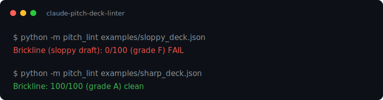

# Raise, the pitch-deck builder and linter

[](LICENSE)



**Build the raise.** A Sequoia-arc pitch deck builder where every word fights for its place. The sloppy example deck scores 0/100 and fails CI. The rewrite ships at 100/100.

Most pitch decks die of adjectives. Words like `revolutionary`, `passionate`,
and `cutting-edge` cost nothing and prove nothing. This is a Claude Code
skill plus a deterministic linter that builds decks the other way: assertions
for headlines, numbers on faces, a source tier for every figure, and a CI
gate that fails the build when the words stop fighting.

- **Problem it solves:** founders polish prose when they should be sourcing claims. Investors notice.
- **Run in under 5 minutes:** `python -m pitch_lint examples/sloppy_deck.json`. The score is the gate, stdlib only, no key.
- **Learn in 15 minutes:** the Sequoia arc, the claims-tier discipline, and 15 lint rules grouped by the four dimensions an investor judges.
- **Claude features it proves:** Claude Code skills, a claude-opus-4-8 narrative read that grades the arc the rules cannot, the draft, lint, iterate loop.
- **Production lesson it encodes:** unsourced numbers sink decks in diligence, not in lint.

## Where this fits

This is the `raise` half of the **Idea** module of [claude-founder-kit](../../README.md). The full journey runs as modules in one repo: first_hour, idea, mvp, launch, scale, quality, cost. The playbook names what a founder does at each stage, and these are the runnable tools that do it. Claude runs the judgment on every stage, and a deterministic gate verifies the output before it ships. One `make demo` from the repo root runs the whole arc live.

## Quickstart

```bash
cd idea/raise   # from the kit root
python -m pitch_lint examples/sloppy_deck.json   # the "before": 0/100, gate fails
python -m pitch_lint examples/sharp_deck.json    # the "after": 100/100
python -m pitch_lint examples/realistic_deck.json # a real founder deck: 74/100, grade C
python tests/test_rules.py                       # the test suite
```

Packaged as a Claude Skill: upload the `skills/pitch-deck/` folder in the Claude app under Settings > Skills. Then say "sharpen my pitch deck" and Claude runs the full workflow: claims inventory first, prose second, lint before anything ships.

## The before and after (actual output, run 2026-06-11)

The sloppy draft - every classic failure in six slides:

```
pitch_lint - Brickline (sloppy draft): 0/100 (grade F)

[PD001 ✗ error] 1:purpose: headline is 16 words; the headline is the claim
[PD003 ✗ error] 1:purpose: banned phrase: "passionate"
[PD006 ✗ error] 2:problem: unsourced number: "$47B"
[PD007 ✗ error] 3:solution: "MegaBuild" is marked anonymize
[PD010 ✗ error] 1:purpose: policy language in speaker notes
[PD005 ✗ error] 5:market: a market slide with no numbers
...
FAIL: 0 < --min-score 80
```

The same company, rewritten on the arc with sourced claims:

```
pitch_lint - Brickline: 100/100 (grade A)
clean - every word fought and won
```

## The claims ledger

Every number in a deck carries a tier, declared in the spec:

| Tier | Means | Rule |
|---|---|---|
| `measured` | you ran it | quotable as-is. First one must land by slide 3 |
| `attested` | someone with standing said it | name who, when asked |
| `public` | citable source | cite it |
| `modeled` | projection | must carry a hedge: "~", "roughly", "modeled" |
| *(absent)* | unsourced | **error - does not ship** |

Named companies are declared too: `named-ok` (permission exists) or
`anonymize` - and a named company never shares a line with a figure.
Logos without numbers, numbers without logos.

## The 15 rules, by the four things an investor judges

The linter reads like a deck review, not a lint dump: it leads with the four
dimensions, then the line items grouped under them. The deterministic rules cover
structure, diligence hygiene, and the AI-startup questions. The strategic call
(is the story compelling, is the market logic sound) is the `pitch-deck` Claude
skill's job, not a regex's. Numbers are one diligence signal, not the verdict.

**Does it tell the whole story?**

| Rule | Catches |
|---|---|
| PD001 | headlines over 8 words (the headline is the claim) |
| PD002 | lines over 20 words (slides are not paragraphs) |
| PD008 | missing Sequoia-arc slides. Over 12 main slides, with clearly marked appendix slides exempt |
| PD009 | first measured evidence later than slide 3 |

**Does it answer what investors will ask?**

| Rule | Catches |
|---|---|
| PD011 | competition slides that never answer platform risk |
| PD014 | no retention, expansion, or renewal slide (the leaky bucket) |
| PD015 | a deck that sells to "everyone" with no specific wedge or first buyer |

**Will it survive diligence?**

| Rule | Catches |
|---|---|
| PD003 | banned phrases (`passionate`, `cutting-edge`, `game-changing`) |
| PD006 | unsourced numbers. Unhedged modeled claims |
| PD007 | anonymity violations. Logos paired with figures |
| PD004 | em-dashes on slide faces |
| PD012 | emoji on a slide face (an AI-slop visual tell) |
| PD013 | generic template copy (the AI landing-page voice) |

**Is the ask clear?**

| Rule | Catches |
|---|---|
| PD005 | numberless slides (market/ask/business-model: error) |
| PD010 | policy language in speaker notes (notes are a talk track) |

Scoring: 100 − 15/error − 8/warn − 3/info. `--min-score 80` gates CI,
the included workflow runs the suite plus both examples on every push.

## The Claude narrative read

The deterministic score is one half. The rules check what you can see slide by slide: a missing source tier, a hedge, a vague ask, a slide with no number. They cannot read the story across slides. claude-opus-4-8 does that pass: it reads the deck in order and returns an investor's view of the arc, where each slide fails to earn the next, the gaps in the arc, and the slide that carries the deck. The rules are the gate, Claude is the critique the rules cannot make.

Claude reviews every interactive run. The gate (check_docs, CI, `--min-score`) stays deterministic and never calls the API. It prints below the score and never changes the score or the exit code, so the deterministic gate stays reproducible.

```bash
pip install anthropic                                       # for the narrative read
export ANTHROPIC_API_KEY=sk-ant-...                         # or put it in .env
python -m pitch_lint examples/sharp_deck.json               # score, then the narrative read on this interactive run
python -m pitch_lint examples/sharp_deck.json --no-judge    # score alone
```

The sharp deck scores a deterministic 100, and the narrative read still pushes on the story an investor would question:

```
Narrative read (claude-opus-4-8, advisory, not scored):
  arc coherence ... 8/10
  gaps:
    - The jump from 31 live sites to 1,000 in 18 months has no go-to-market motion behind it.
    - Why-now leans on vision models and retiring inspectors, but does not tie the timing to this company.
  strongest ....... Solution: photo to signed inspection in 11 minutes, with live numbers that pay off the problem.
```

With no key the linter is the score alone, so CI runs the gate without a key and stays green. Reading one deck you already have is a single structured generation, so this uses the Messages API, not the Agent SDK.

## Render it

The renderer depends on [`pptxgenjs`](https://www.npmjs.com/package/pptxgenjs). Install it once (creates `render/node_modules`):

```bash
npm install --prefix render                          # one-time: installs pptxgenjs
node render/deck_from_spec.mjs deck.json             # presenter deck, notes included
NO_NOTES=1 node render/deck_from_spec.mjs deck.json  # share-safe, notes stripped
```

Send only the PDF or the `_SHARE` variant. The noted file is yours alone.

## Where the rules come from

Field lessons from advising startups on pitches, wedges, and platform-risk
answers, then pressure-tested by applying every rule to a real deck that had
to survive real diligence. The platform-risk rule (PD011) is the one that
matters most: *why not the incumbents, why not the platform, why not the
model providers, what survives platform gravity?* Decks that cannot answer
that question are not ready, however good the prose.

Pair-built with Claude. That's not a disclaimer, it's the demo.

## Limitations

The linter checks the words and the claim discipline, not whether the business
is fundable: a 100/100 deck with weak numbers still loses the room. It reads a
JSON spec, not a PDF or PPTX. The Sequoia arc is the default shape, not the only
one. Override it when the story needs a different order.

## License

[MIT](LICENSE)
