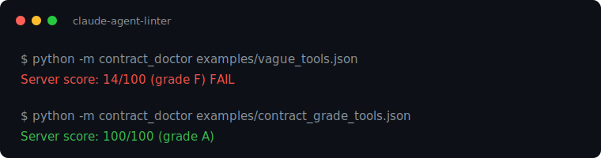

# Harden, the agent and MCP security review

[](LICENSE)



**Harden the agent and assistant interfaces.** Turn vague MCP tools into contract-grade agent interfaces. A vague example server scores 14/100. The contract-grade rewrite scores 100/100. 16 rules, including an OWASP/STRIDE security lens, a tool-discovery check, and a context-budget check.

Most agent bugs aren't model failures - they're vague tool semantics. The model
is the caller of your API, and it can't read your source. A tool description
that says `"Gets the data."` forces the model to guess inputs, invent failure
handling, and coin-flip between overlapping tools. This linter makes those
contract gaps visible and scores them with a deterministic rule set that gates
in CI. With a key, Claude rewrites the worst offender, the rewrite the rules can
name but cannot write, and the same rules re-score it, because evals beat vibes
even for prose.

- **Problem it solves:** agents misuse tools whose contracts are underspecified. Teams debug the model when they should be fixing the interface.
- **Run in under 5 minutes:** `python -m contract_doctor examples/vague_tools.json` - no dependencies, stdlib only.
- **Learn in 15 minutes:** the sixteen contract rules below, the CI gate, and the judge loop.
- **Claude features it proves:** MCP tool schemas as a first-class surface, plus Claude-as-judge with deterministic re-validation.
- **Production lesson it encodes:** tool descriptions are API contracts. Failure modes and side effects are half the contract.

## Where this fits

This is the `harden` half of the **MVP** module of [claude-founder-kit](../../README.md). The full journey runs as modules in one repo: first_hour, idea, mvp, launch, scale, quality, cost. The playbook names what a founder does at each stage, and these are the runnable tools that do it. Each stage keeps a deterministic gate, and live Claude calls run only where the command says a key is required. One `make demo` from the repo root runs the live walkthrough when a key is set.

## Quickstart

```bash
cd mvp/harden   # from the kit root
python -m contract_doctor examples/vague_tools.json          # the "before": 14/100
python -m contract_doctor examples/contract_grade_tools.json # the "after"
python -m contract_doctor examples/realistic_tools.json      # a real server: 58/100, grade D
python tests/test_rules.py                                   # the test suite
```

Lint a live FastMCP server directly (needs `pip install mcp`):

```bash
python -m contract_doctor path/to/your_fastmcp_server.py
```

Or dump any MCP server's `tools/list` response to JSON and lint that - the
linter reads the wire format, so it works for servers in any language.

## The before / after (actual output, run 2026-06-14)

The vague server - five tools the model has to guess at:

```
Server score: 14/100 (grade F)

tool           score  grade  findings
-------------  -----  -----  --------
send               0      F  6×✗ 2×· 1×!
update             6      F  5×✗ 1×· 2×!
process           13      F  4×✗ 1×· 3×!
handle_record     13      F  4×✗ 1×· 3×!
get_data          36      F  3×✗ 1×· 2×!

FAIL: 5 tool(s) below --min-score 70
```

The same five tools rewritten as contracts ([examples/contract_grade_tools.json](examples/contract_grade_tools.json)):

```
Server score: 100/100 (grade A)
```

## It caught a real one: my demo repo failed its own lint

The first real server this linter ever scored was the MCP server in the sibling `build/`
module, whose entire pitch is teaching tool-contract discipline. Its docstrings
preach the gospel: exact semantics, failure modes, what not to infer. The repo
even says, in a comment, *"vague descriptions are the #1 agent bug in the wild."*

It scored **77/100, grade C.**

Why: every parameter description was **empty in the published schema**. FastMCP
publishes your docstring as the *tool* description - but *parameter* docs come
from the input schema, and a plain `name: str` annotation ships nothing. So the
model received beautifully documented tools whose arguments (`name`, `month`)
carried zero documentation. The docstring discipline was real. It just never
reached the wire. The contract you write and the contract the model receives
are not the same artifact - and only one of them matters.

The fix took minutes: `Annotated[str, Field(description=...)]` on each
parameter, plus explicit failure-mode sentences in two docstrings (and a real
divide-by-zero guard the lint pressured into existence). The server re-lints at
**100/100, grade A** - and that commit lives in the sibling module's history.

Three lessons worth keeping:

1. **Discipline you can't lint will drift** - even when you're the one teaching it.
2. **Lint the wire format, not the source.** This tool reads `tools/list` output,
   so it grades what the model actually sees, in any framework or language.
3. **The fail-closed instinct cuts both ways.** A linter that had only ever seen
   its own examples would be a toy. The first outside contact found a real bug
   in the author's own demo repo. That is the test worth passing.

```bash
# gate your own server the same way
python -m contract_doctor your_tools.json --min-score 80 || exit 1
```

## The judge loop (actual output, run 2026-06-14)

The rule score is the deterministic gate. Claude reviews every interactive run
and rewrites the worst tool. The gate (check_docs, CI, `--min-score`) stays
deterministic and never calls the API. With no key the rewrite is skipped and the
score is unchanged, which is how CI stays green offline.

```bash
ANTHROPIC_API_KEY=... pip install anthropic
python -m contract_doctor examples/vague_tools.json   # the rewrite runs on this interactive run
```

The deterministic rules pick the worst tool (`send`, score 0) and hand Claude
the definition plus the findings. Claude returns a rewritten contract -
delivery semantics, non-idempotency declared, error shape per field, enum'd
priority tiers, worked example - and the same rules re-score it:

```
re-lint: 0 (F) -> 100 (A)
```

Claude writes the contract the rules could name but not write. The rules keep
the score honest, and they never move because Claude ran. That split is the
point: Claude does the judgment, the deterministic gate proves it. Pass
`--no-judge` for a deterministic-only run, or `--judge` to force the rewrite on
regardless of the TTY (it prints a skip notice when no key is set).

## The sixteen rules

| Rule | Severity | What it catches |
|---|---|---|
| CD001 | error | One-line descriptions that aren't contracts |
| CD002 | warn | Generic names (`process`, `get_data`) that force routing guesses |
| CD003 | error | Parameters with no description - where agents invent arguments |
| CD004 | warn | Shaped strings (ids, dates, modes) with no enum/format/pattern |
| CD005 | error | No failure-mode documentation - the half of the contract everyone skips |
| CD006 | error | Mutating tools that don't declare side effects or idempotency |
| CD007 | warn | Undocumented return shape |
| CD008 | warn | Near-duplicate tools the model can't choose between |
| CD009 | info | No `required` array - the model guesses what it may omit |
| CD010 | info | 3+ parameters and no worked example |
| CD011 | warn | Marketing slop (`powerful`, `seamless`, `robust`) - adjectives spending tokens that semantics needs |
| CD012 | warn | Security: a raw secret passed as a model-visible argument |
| CD013 | warn | Security: a destructive op (delete, charge, transfer) with no stated reversibility or confirmation |
| CD014 | warn | Security: executes or forwards free-form input into a code, shell, SQL, or URL sink (injection / SSRF) |
| CD015 | warn | Discovery: a raw query/exec escape hatch beside curated tools, so the agent bypasses the surface and hits the backend directly |
| CD016 | warn | Context: a search/list tool that returns a collection with no documented bound (limit, page, top-N), spending the model's context budget on an unknown number of tokens |

CD012-CD014 are the agent/MCP slice of an OWASP + STRIDE pass: the threats that
are specific to tools an LLM can call. Each finding also carries a `fix_kind`
(`auto` for mechanical deletions, `ask` for judgment calls).

Scoring: each tool starts at 100. Error −15, warn −8, info −3. A ≥90, B ≥80,
C ≥65, D ≥50, F below.

## Lint the agent protocol, not just the tools

Tools are half the contract. The agent's rules of engagement are the other
half. Lint a protocol doc (AGENTS.md or a SKILL.md) for the boundaries an agent
needs, grouped the way the AGENTS.md convention does:

```bash
python -m contract_doctor --protocol examples/AGENTS.md
```

It checks for always-do, ask-first, and never-do boundaries, a failure plan,
and a success metric (rules PR001-PR005). An agent with no stated boundaries
acts on a guess, which is how autonomy turns into incidents.

## Grade the harness, not just the tools

Most agents that fail in production do not fail on a bad prompt. They fail on
harness design, the architecture a startup wires Claude into. This grades a
harness manifest against the dimensions the well-architected open harnesses
converged on (LangChain DeepAgents, LangGraph, Claude Code, Cursor):

```bash
python -m contract_doctor.harness examples/harness_good.json    # 100/100
python -m contract_doctor.harness examples/harness_naive.json   # 23/100, the monolith
```

Ten rules (HA001-HA010): decomposition into subagents, a **structured return
contract** so a subagent talks to its parent and its parallel siblings, **async**
sibling execution, context **isolation and offload**, conversation **compaction**
(model-controlled and selective, because even a 1M window fills on a long agentic
loop), **memory** (episodic, procedural, semantic), **skills as first-class with
progressive disclosure**, a **gate on outward actions**, **prompt caching** on the
stable prefix, and **checkpointing** so a long run resumes. The rules grade
against task complexity: a one-shot agent is not pushed to add subagents, memory,
or compaction it does not need, while a long-running loop is held to all ten. A
naive monolith holds every step in one window, never compacts, never remembers,
and acts ungated. The manifest makes the architecture reviewable as data.

## Lint a skill, because skills are first-class

A skill is three layers: a `description` that is always in context and triggers
it, a body loaded on demand, and references for the deep detail. That is
progressive disclosure, the way DeepAgents and Claude Code treat skills. This
grades a SKILL.md on those terms:

```bash
python -m contract_doctor.skill skills/agent-linter/SKILL.md   # 100/100
```

Seven rules (SK001-SK007): a description that triggers (present, tight, with a
"use when" cue), a body that does not load the whole manual on every trigger
(point depth at references), a workflow structure, and guardrails. A skill with
no description never fires. A skill that is one giant prompt defeats progressive
disclosure.

## Design tool outputs for the context budget

A tool's output is a context-engineering surface, not just its input. The model
reads every token a tool returns, and that context is a finite budget, so a tool
that hands back an unbounded or raw payload spends the budget the next reasoning
step needs. The rules pull in this direction:

- **CD016** flags a search or list tool that returns a collection with no stated
  bound, the unbounded-list case that floods the window.
- **CD007** wants the return shape documented, so the model fetches once and
  knows what it got instead of re-calling to discover the shape.
- **CD011** flags marketing words in a description, because every token spent on
  vibes is a token not spent on semantics, on both sides of the call.
- The **harness** grader (HA rules) checks context isolation, offload, and
  compaction, because even a large window fills on a long agentic loop.

The move the linter cannot make for you: trim the fields the model does not use.
A documented bound (the contract-grade example returns "at most 25") plus a lean
record is a cheaper and more reliable agent.

## Gate it in CI

```bash
python -m contract_doctor mcp_tools.json --min-score 80 || exit 1
```

Exit code 1 the moment any tool drops below the bar - the same
evals-before-vibes wiring you'd give an agent's behavior, applied to the
agent's interface.

## Claude Skill

Packaged as a Claude Skill in [`skills/agent-linter/SKILL.md`](skills/agent-linter/SKILL.md). Upload the `skills/agent-linter/` folder in the Claude app under Settings > Skills (see [Anthropic's skills guide](https://github.com/anthropics/skills)). Then say "lint my MCP tools" or "harden my agent." Claude reads the tools, runs the rules and the security lens, and can rewrite the worst tool, then re-score it.

## Why this exists

This repo encodes a field lesson from AI-infrastructure work with neo-cloud
GPU providers and the startups I advise:
a production agent's tool-call error rate is usually an interface problem.
Rewriting tool descriptions as contracts - exact semantics, failure shapes,
side-effect declarations - is one of the cheapest reliability wins in agent
engineering, and it's lintable. So lint it.

Pair-built with Claude. That's not a disclaimer, it's the demo.

## Limitations

The linter grades the tool contract, not the code behind it: a 100/100 server
can still have bugs behind a well-described interface. The security rules
(CD012-CD014) are a first pass over the threats specific to LLM-callable tools,
not a full security review. Claude's rewrite needs an API key and is not
deterministic, so the rule score, not the rewrite, is the gate: the score
reproduces and the rules keep it honest.

## License

[MIT](LICENSE)
