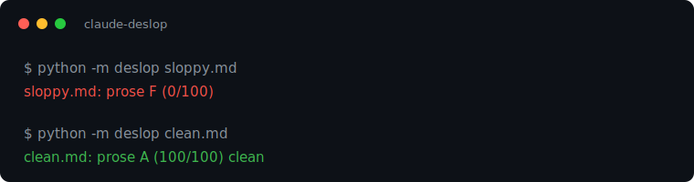

# Quality, the de-slop linter

[](LICENSE)



Deterministic de-slop linter: a sloppy doc scores F, clean prose scores 100.
One canonical ruleset finds AI-slop in two places: the **prose** (em-dashes,
buzzwords, filler phrases, `it's not X, it's Y` framing, generic template copy)
and the **rendered output** (purple gradients, centered-everything,
emoji-as-design, border-left cards). Plain Python, stdlib
only, MIT.

It is also the source of truth for de-slop across the kit: the
word and phrase lists live here, in [`deslop/slop_rules.json`](deslop/slop_rules.json),
and `scripts/sync.py` copies them out so nothing drifts by hand.

- **Problem it solves:** rules hand-copied into a resume builder, a PDF check, and three linters drift apart, and an artifact that reads generated gets trusted less.
- **Run in under 5 minutes:** `python -m deslop examples/sloppy.md` then `examples/clean.md` - F then A, stdlib only.
- **Production lesson it encodes:** numbers over adjectives, short verb-led sentences, no line that could open any company's landing page.

## Value Bar

The de-slop linter is a candidate until it is adversarially-confirmed to add value for a real artifact review. A clean score means the rules passed. It does not prove the writing is more trusted until a skeptical reviewer compares before and after against a baseline.

## Where this fits

This is the **Quality** module of [claude-founder-kit](../README.md), the de-slop discipline that runs across every stage. The full journey runs as modules in one repo: first_hour, idea, mvp, launch, scale, quality, cost. The kit names what a founder does at each stage, and these are the runnable tools that do it. Each stage keeps a deterministic gate, and live Claude calls run only where the command says a key is required. One `make demo` from the repo root runs the live walkthrough when a key is set.

## Why

"Deslop everything" started as a habit and kept regressing, because the rules
were hand-copied into a resume builder, a PDF check, and three linters that then
drifted apart. This repo makes the rules a single artifact with a linter, a
score, and a sync check. Numbers over adjectives. Short, verb-led sentences. No
line that could open any company's landing page.

For a founder the stakes are credibility, not polish. Investors and recruiters
read a lot of AI output, and a deck, README, or resume that smells generated
gets trusted less. This is the de-slop pass that keeps your own voice on the
artifacts you raise and hire with.

## Use

```bash
python -m deslop README.md           # prose: grade + findings
python -m deslop index.html          # prose + visual AI-slop blacklist
echo "We leverage seamless synergy" | python -m deslop -
```

Exit code is the count of error+warn findings (capped at 255), so it works in a
pre-commit hook or CI step. As a library:

```python
from deslop import lint, lint_text, lint_html
report = lint(open("README.md").read())   # {prose_grade, findings, ...}
```

`lint` returns the report dict shown above. `lint_text` and `lint_html` return just the list of findings.

There is also a `deslop` Claude Code skill. The kit bundles it under `.claude/skills/`, so it installs with the rest of the kit. To use it on its own, upload the [`skills/deslop`](skills/deslop/SKILL.md) folder in the Claude app under Settings > Skills:
it lints, then rewrites the flagged lines and re-lints until clean.

### Blessing intentional choices: `.desloprc`

Drop a `.desloprc` at your repo root (see [`.desloprc.example`](.desloprc.example))
to permit a word, phrase, or rule you mean to keep. An advisor can ship one
house-style file across a portfolio.

```json
{ "allow_words": ["robust"], "allow_phrases": [], "disable_rules": ["DS013"] }
```

The CLI auto-loads it from the linted file's directory. The library takes it as
`lint(text, config=load_config("."))`.

### The Claude judge

The rules catch the slop you can enumerate. They cannot catch slop that needs reading: a vague claim, a hedge, an empty sentence that could sit in any document. The judge has claude-opus-4-8 read for those and prints them as advisory notes. Claude reviews every interactive run. The gate (check_docs, CI, `--min-score`) stays deterministic and never calls the API. It prints below the score and never changes the score or the exit code, so the deterministic gate stays reproducible. The gate is deterministic by design, that is what a gate is, and Claude rides on top.

```bash
pip install anthropic                              # optional dependency
export ANTHROPIC_API_KEY=...                       # or put it in .env
python -m deslop README.md                         # judge reviews this interactive run
python -m deslop README.md --judge                 # force it on, even piped or in CI
python -m deslop README.md --no-judge              # the rule score alone, even with a key
```

Text the rules pass can still draw a note. A line with no dash and no listed buzzword scores a clean A, and the judge still flags it when it says nothing:

```
stdin: prose A (100/100)
  clean
  [judge] 1 advisory note(s) from claude-opus-4-8 (not scored):
    - "Our platform helps teams do more with less."
      why: Vague claim with no specifics about what the platform does or saves.
      try: Our platform cuts report prep from three hours to twenty minutes.
```

With no key the judge is a no-op and the linter behaves exactly as before, so CI stays green offline. This is a single structured read of text you already have, so it uses the Messages API, not the Agent SDK.

## Rules

Prose (`lint_text`): DS001 dash tell (em, en, bar, figure), DS002 buzzword
(`cutting edge` counts like `cutting-edge`), DS003 filler phrase,
DS004 `it's not X, it's Y`, DS005 generic template copy, DS006 draft marker or
unfilled placeholder (`TODO`, `FIXME`, `once this repo has a remote`, a
`<your-org>` stub), DS007 emoji in prose. Prose rules skip fenced and inline
code, so install snippets and flag names are never flagged as prose.
Visual (`lint_html`): DS010 purple/indigo palette, DS011 centered-everything,
DS012 emoji-as-design, DS013 colored left-border card. Severities deduct from
100. Prose and visual are graded A-F separately.

## Single source of truth

[`deslop/slop_rules.json`](deslop/slop_rules.json) is canonical. The other kit modules and the
resume and deck builder vendor a synced copy and load from it:

```bash
python scripts/sync.py            # copy canonical into every target
python scripts/sync.py --check    # fail if any copy drifted (pre-push / CI)
```

Targets: the resume and deck builder (`deslop_rules.js`), and the idea/validate, idea/raise,
and mvp/harden modules. Modules that cite the canon in prose or prompts rather than code
(claude-gpu-perf-tune, the mvp/build module) are not synced from here.

## Credits

The word, phrase, and visual-slop lists merge this project's own canon with the
gstack writing rules ([github.com/garrytan/gstack](https://github.com/garrytan/gstack),
MIT) and the visual blacklist gstack cites from OpenAI's "Designing Delightful
Frontends." See [NOTICE](NOTICE).

## Limitations

Heuristic, not a proofreader. The rules match known AI-slop tells, so they miss
novel slop and can flag a choice you meant to keep (bless it in `.desloprc`). A
clean score means no known tell fired, not that the writing is good. The visual
checks read HTML and CSS, not a rendered screenshot.

## License

[MIT](LICENSE)
